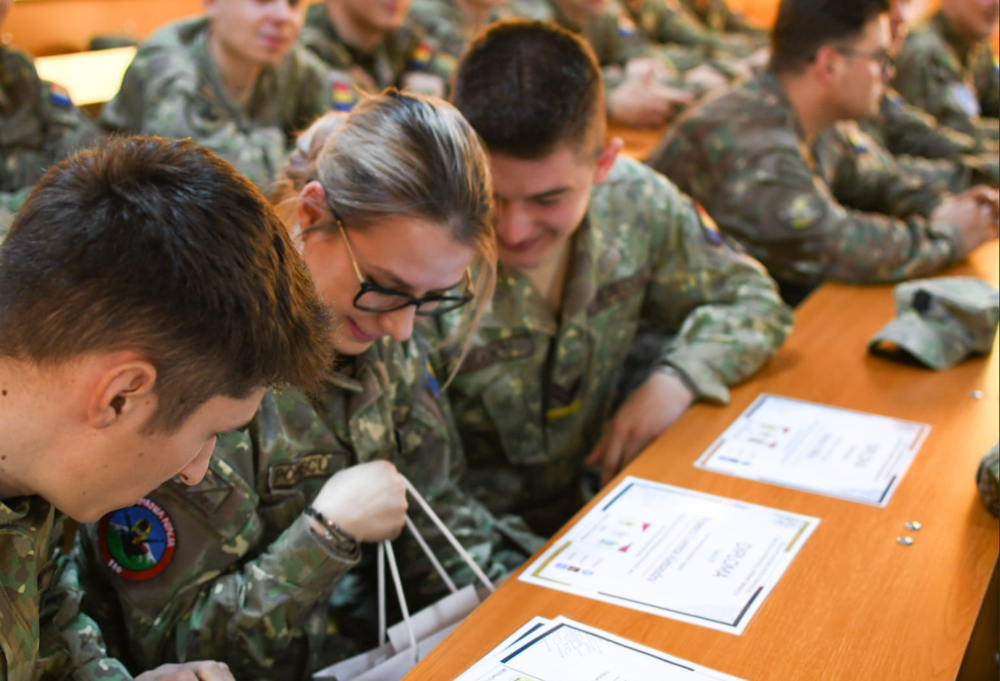
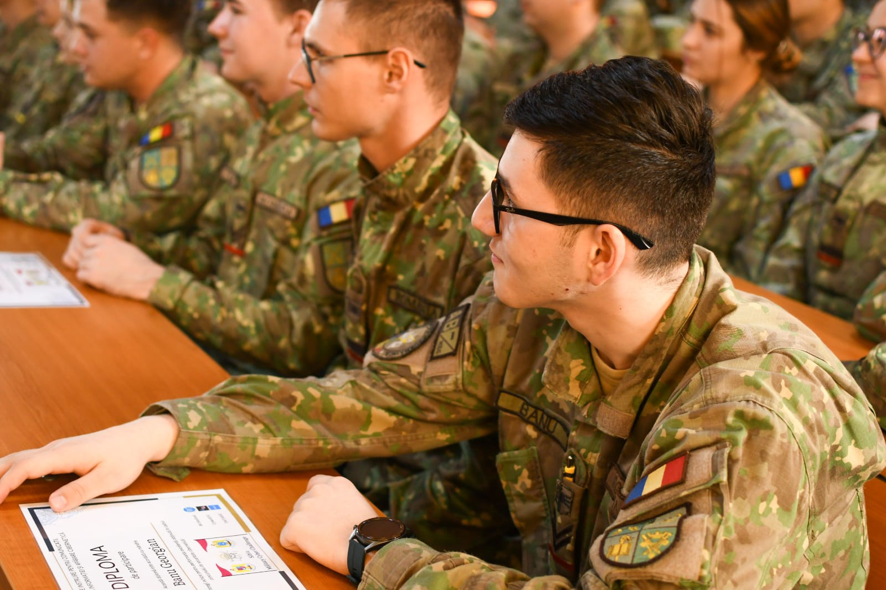
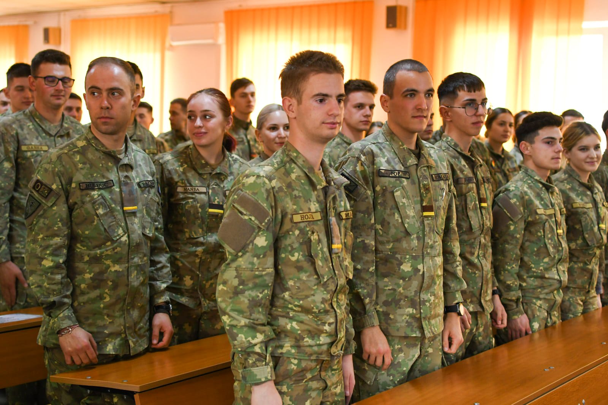

# Sibiu Military Cyber Challenge 2023
```
Beginner-Intermediate CTF for my colleagues in the military academy and school in Sibiu, Romania
```

<br>

<table border="0">
  <tr>
    <td></td>
    <td></td>
  </tr>
</table>
<table border="0">
  <tr>
    <td></td>
    <td></td>
  </tr>
</table>

<br>

[](https://zenodo.org/badge/latestdoi/579676201)

<br>

# What is here?
```
- Infrastructure in detail

- Categorized challenges
    - description
    - solution
    - how to create (optional)  
```

<br><br>

# What else?
```
Hope you will enjoy my content and learn some interesting, new things!

I fixed the *portability* of the scripts: you can now run them from your machine.

The server is not online anymore.
```

<br><br>

# SMCC 2024
```
If you are part of one of the Romanian military education institutions, be on the lookout for SMCC 2024!

I will coordonate this CTF as well and it will take place in the beginning of March, 2024.
```
